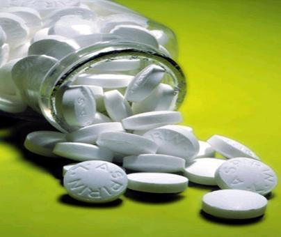
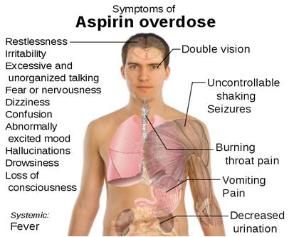
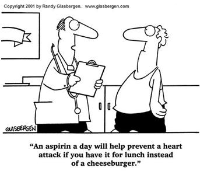

## Introduction:
 

Charles Frederic Gerhardt, a French chemist was the first to prepare aspirin in 1853. Aspirin is also known as acetylsalicylic acid. It is the acetyl derivative of salicylic acid and is an example of a salicylate drug. 

 

<strong>IUPAC Name:</strong> 2-acetoxybenzoic acid

<strong>Chemical Formula:</strong> C9H8O4

<strong>Physical State:</strong> Colourless, Odorless, white crystalline powder

<strong>Melting Point:</strong> 137°C (with decomposition)

<strong>Boiling Point:</strong> 140°C

<strong>Specific Gravity:</strong> 1.35

<strong>Solubility in Water:</strong> Soluble

### Structure:

  

## Synthesis of Aspirin:
 

Aspirin is commercially synthesized using a two-step process known as the Kolbe-Schmitt reaction. 

 

### Step 1:

 

Phenol is treated with sodium hydroxide generating sodium phenoxide, which is then reacted with carbon dioxide under high temperature and pressure to yield sodium salicylate, which is acidifed, yielding salicylic acid.

  

### Step 2: 

 

Salicylic acid is then acetylated using acetic anhydride, yielding aspirin and acetic acid as a byproduct. The yield of this reaction is very low due to the relative difficulty of its extraction from an aqueous state. For bulk production the salicylcate is acidified with phosphoric acid under reflux for 1 hour 40 minutes.

  

### Application and Side Effects of Aspirin:

  

 

<ol>
  <li>Acetylsalicylic acid is used as an analgesic, antipyretic, anticoagulant, and anti-rheumatic.</li>
  <li>It is also used as an additive in food, animal feed, drugs, and cosmetics.</li>
  <li>Low doses of aspirin may be given immediately after a heart attack to reduce the risk of another heart attack or death of cardiac tissue.</li>
  <li>It has been used for the treatment of rheumatoid arthritis, rheumatic fever, and mild infections.</li>
  <li>Large doses of aspirin cause acid-base imbalance and respiratory disturbances and can be fatal, especially in children.</li>
  <li>Gastrointestinal ulcers, stomach bleeding, and tinnitus are the main undesirable side effects of aspirin.</li>
</ol>

### Principle and Procedure:

The amount of aspirin can be determined by brominating using a KBrO₃–KBr mixture. A definite amount of aspirin is refluxed with NaOH, forming salicylic acid. The excess brominating mixture formed is then titrated with standard thiosulfate solution.

  

<strong>Preparation of KBr–KBrO₃ solution:</strong> Dissolve 75 g of KBr and 5.36 g of KBrO₃ in water and make up to 1 litre.

a) Standardisation of Na2S2O3: 

0.5 g K2Cr2O7 is weighed accurately and made upto 100 mL. 20 mL is pipetted out into a conical flask. Then add 3 mL con.HCl followed by 5mL 10% KI and titrated against Na2S2O3 using starch as indicator.

<strong>a) Standardisation of Na2S2O3:</strong>

0.5 g of K2Cr2O7 is weighed accurately and made up to 100 mL. 
20 mL is pipetted out into a conical flask. Then add 3 mL concentrated HCl followed by 5 mL of 10% KI and titrate against Na2S2O3 using starch as indicator.

<strong>b) Estimation of Aspirin:</strong>

1.5 g of aspirin is weighed into a round-bottom flask. Then 40 mL of 10% NaOH is added and the mixture is refluxed for 15 minutes. 
Transfer the solution quantitatively into a 250 mL standard flask and make up to the mark. 
From that, 20 mL is pipetted, acidified with 2 mL concentrated HCl. 
Then add 50 mL of brominating mixture, shake well for 15 minutes. 
Then 10 mL of 10% KI is added, diluted with water, and titrated against standard Na2S2O3 using starch as indicator.

## Calculation:

<strong>Normality of thio:</strong> N₁

<strong>Weight of aspirin:</strong> W g

<strong>50 mL brominating mixture =</strong> X mL thio

<strong>20 mL aspirin + 50 mL brominating mixture =</strong> Y mL thio

<strong>Amount of thio:</strong> X − Y = Z mL

<strong>Normality of aspirin:</strong> (Z × N₁) / 20 = N₂

<strong>Amount of aspirin in the whole of the given solution:</strong> (N₂ × Equivalent weight of aspirin) / 4 = A g

<strong>% of aspirin:</strong> (A × 100) / W = B %

#### References of Images: 
- https://en.wikipedia.org/wiki/Salicylate_poisoning
- https://2.bp.blogspot.com/_yGpz3Q5FBj8/TP4h7vbznxI/AAAAAAAAHak/JNXT5ldHTtQ/s1600/AspirinADay%255B1%255D.gif
